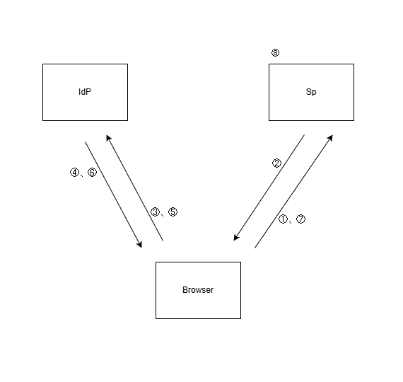

# 前提知識

## HTTP Sessionについて
HTTPは本来「状態を持たない（Stateless）」プロトコルであり、一度の通信が終わればサーバーはクライアントを忘れてしまいます。これを解決するのが**セッション**です。

* **Cookieの役割:** サーバーが発行した「会員証（セッションID）」をブラウザに保存する仕組み。ブラウザは次回の通信時にこのCookieを自動的にサーバーへ提示します。
* **セッションの維持:** サーバー側では、受け取ったセッションIDをキーにして「この人はログイン済みの〇〇さんだ」という情報をメモリやデータベースから取り出します。
* **セキュリティ上の注意:** セッションIDが盗まれると「なりすまし」が可能になるため、`HttpOnly`（JavaScriptからのアクセス禁止）や`Secure`（HTTPS通信時のみ送信）といった属性の設定が必須です。

## HTTP Redirectについて
サーバーがブラウザに対して「別のURLへ移動してください」と指示を出す仕組み（ステータスコード302など）です。

* **SAMLにおける役割:** ユーザーが未認証でアプリに来た際、認証基盤（IdP）のログイン画面へ「飛ばす」ために多用されます。
* **データの運搬:** リダイレクト先のURLにパラメータ（`?SAMLRequest=...`）を付与することで、ブラウザを介して認証基盤へ情報を渡します。

---

# SSOの仕組み

1. ブラウザがSp（アプリ）にアクセス
2. 未セッション状態なので、Idp(認証基盤)へリダイレクトを要求
3. ブラウザがIdpへアクセス
4. 未認証状態のため、ログイン画面が返される。（認証済みであれば⑥へ進む）
5. ログイン情報を送る。
6. 認証できれば、認証情報(トークンやXML)をSpへ受け渡すようにSpへリダイレクト(もしくはHTTP POST BINDING)を要求
7. Spアプリにアクセス
8. 認証情報を検証し、HTTPセッションを確立する。

---

# SAML認証について
SAML認証は、アプリ（SP）と認証基盤（IdP）が**「標準化されたメッセージ（XML）」を交換して信頼を築くモデル**です。

### 実装者が意識すべきポイント
1.  **「待っていれば情報が来る」わけではない:** アプリ側でSAMLのリクエストを生成し、戻ってきたレスポンスを「検証（署名チェックなど）」して、初めてユーザー情報を得られます。
2.  **ライブラリの活用:** XMLの解析や署名検証を自作するのは非常に危険です。標準的なライブラリを導入し、正しく設定（Entity IDや証明書の設定）することが主な作業になります。
3.  **デバッグ対象の変化:** HTTPヘッダーを見るのではなく、ブラウザを行き来する「SAML Request/Response（Base64エンコードされたXML）」をデベロッパーツール等で追跡するスキルが求められます。

